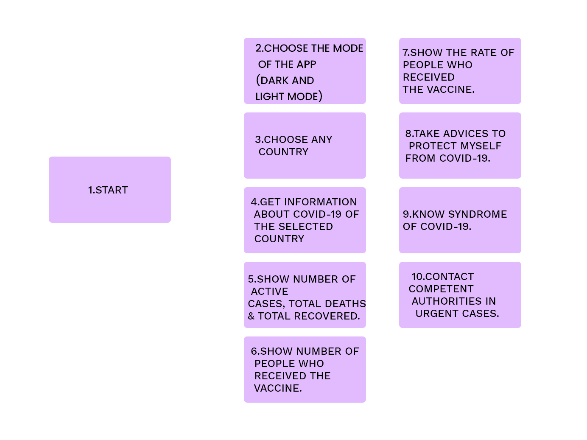

# Covid-19-app

## ✧Problem

- There is not enough apps to make it easier for users to access information about the covid-19, which makes it difficult for people to access the latest updates about the disease.
- There is many people who don't recive vaccine so in this app, we ecourage people to recive.
- There is many people who don't follow the rules of covid-19 and ignore it.
- There is many people who don't know syndrome of covid-19.

## ✧Solution

- In this app, we show all information about covid-19 like number of active cases, total recoverd & total deaths.
- We show the rate of people who received vaccine to ecourage people to do it.
- We add advices to protect you from covid-19.
- We add the syndrome of covid-19.

## ✧links :

[design link](https://www.figma.com/file/xGo4z5C2UQMyTqf2TKuDFK/Covid-19-Team4?node-id=0%3A1)

[live link](https://gsg-fc03.github.io/Covid-19-app/)

## ✧The wireframes ( The initial screens) :

   
  

## ✧User Journey

The user enters the app and presses the start button through the home page.
When you click on the start button, it moves you to the next page where you can choose the country to know the number of active cases, recovered people and total deaths.
In addition, if you want to know how many people have received the covid-19 vaccine, you can press the next button. So you move to rate of people who recives the vaccine. In the same page there is an advice button which move to advices page. The advices page show to you important advicses to protect you from covid-19.
Also, we add page for syndrome of corona to let people know it.
The last page is contact which provide you to know the information that help you in urgent cases.

## ✧User Story

- As a user, I can click on start button to move from welcome page to home page.
- As a user, I can choose the mode of the app(dark and light mode).
- As a user, I can choose any country.
- As a user, I can get information about covid-19 of the selected country.
- As a user, I can show number of active cases, total deaths & total recovered.
- As a user, I can show number of people who received the vaccine.
- As a user, I can show the rate of people who received the vaccin.
- As a user, I can take advices to protect myself from covid-19.
- As a user, I can know syndrome of covid-19.
- As a user, I can contact competent authorities in urgent cases.

## ✧The way of installation to run project locally :-

- As a user:

1. I can clone code from github by copy the link.
2. Open git bash.
3. write git clone and paste the link.
4. to open the code, write (**code .**).
5. to show the pages, open **Go live** Or right click mouse and select **"open with live server"**.

## ✧Resources

API documentation:

- API (1) : [covid api](https://documenter.getpostman.com/view/10808728/SzS8rjbc)

- API (2) : [vaccine api](https://disease.sh/v3/covid-19/vaccine/coverage/countries?lastdays=1%E2%80%8F)

## ✧Team Members

- Monther AlZamli
- Heba Al-Tanani
- Rawan Zaqout
- Nada Saleh
